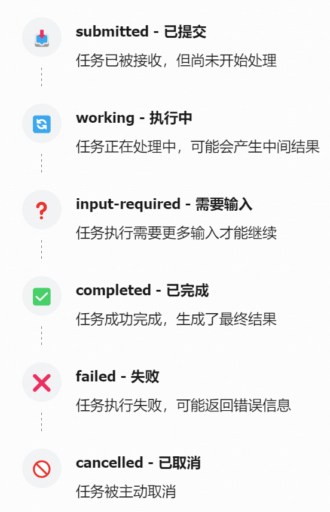

# A2A协议学习
**实现智能体之间的标准化通信，促进不同系统间的无缝协作，提供统一的交互接口，让不同公司、不同底层技术的AI智能体能够安全地相互交流**
## 核心概念
| 核心概念 | 定义与作用 | 应用场景 |
|----------|------------|----------|
| Agent Card 代理卡片 | 公共元数据文件，描述智能体的能力、技能、端点URL和认证要求 | 客户端发现和选择合适的智能体进行协作 |
| A2A Server A2A服务器 | 暴露HTTP端点并实现A2A协议方法的代理，接收请求并管理任务执行 | 提供AI服务能力，响应其他智能体的请求 |
| A2A Client A2A客户端 | 消费A2A服务的应用程序或另一个代理，发送请求到A2A服务器 | 调用其他智能体提供的能力，完成复杂任务 |
| Task 任务 | 工作的核心单元，具有唯一ID和生命周期状态 | 请求其他智能体执行特定操作，如数据分析、图像生成等 |
| Message 消息 | 客户端和智能体之间的通信轮次，包含多个部分 | 智能体间传递信息、提出问题或返回结果 |
| Part 部分 | 消息或工件中的基本内容单元，可以是文本、文件或数据 | 构建多模态消息，如包含文本说明和图像数据的消息 |
| Artifact 工件 | 智能体在任务过程中生成的输出，如生成的文件、最终数据 | 存储和传输任务执行结果，如分析报告、生成的图像等 |
- AgentCard：公共元数据文件，描述智能体的能力、技能、端点url和认证要求，帮助客户端发现和选择合适的智能体。

        `agent_card = AgentCard(
            name='Hello World Agent',
            description='Just a hello world agent',
            url='http://localhost:9999/',
            version='1.0.0',
            default_input_modes=['text'],
            default_output_modes=['text'],
            capabilities=AgentCapabilities(streaming=True),
            skills=[skill],
            supports_authenticated_extended_card=True,
        )`
- A2A Server：暴露HTTP端点并实现A2A协议方法的代理。接收请求并管理任务执行，是智能体提供服务的接口。
`//服务端实现
server = A2AStarletteApplication(
    agent_card=agent_card,
    http_handler=request_handler,
)`
- A2A Client：消费A2A服务的另一个代理或应用程序。向A2A服务器的URL发送请求（如tasks/send），发起与智能体的通信。
`//客户端实现
client = A2AClient(httpx_client=httpx_client, agent_card=agent_card)`
- Task:工作的核心单元，具有唯一ID和生命周期状态。客户端通过发送消息启动任务，是智能体间协作的基本工作单位。
- Message:作为客户端与服务端交互的单元
- 
## 技术实现
### 通信模型
A2A协议采用客户端-服务器模型，其中智能体可以同时扮演客户端和服务器的角色，实现双向通信和协作。
### A2A协议通信流程
- 1.能力发现：客户端获取并解析AgentCard，了解其能力和接口。
- 2.任务提交：客户端向服务端发起任务请求，包含任务描述和参数。
- 3.任务执行：服务端接收到任务请求后执行任务，可能需要其他智能体协作。
- 4.状态更新：服务端通过SSE向客户端发送任务执行状态
- 5.结果返回：任务结束后，服务器发送结果给客户端。
- 6.任务完成：客户端确认任务结果，通信结束。
### 任务生命周期管理
状态	描述	触发条件

### 任务执行流程：
A2A协议的任务执行流程如下：
- 1.客户端获取Agent Card，了解智能体能力
- 2.客户端发送任务请求（通过tasks/send端点）
- 3.服务器接收请求，创建任务并存储
- 4.服务器调用AgentExecutor的execute方法处理任务
- 5.执行器完成任务，通过EventQueue发送结果
- 6.服务器返回结果给客户端
## 搭建流程：
- 1.实现智能体执行器

        `class HelloWorldAgent:
            """简单的Hello World智能体实现，实现实际业务"""
            async def invoke(self) -> str:
                """执行智能体逻辑，返回Hello World"""
                return 'Hello World'
        
        class HelloWorldAgentExecutor(AgentExecutor):
            """A2A协议兼容的执行器，实现A2A协议的接口，处理任务执行和取消"""
            def __init__(self):
                self.agent = HelloWorldAgent()
        
            async def execute(
                self,
                context: RequestContext,
                event_queue: EventQueue,
            ) -> None:
                """执行任务并将结果发送到事件队列"""
                # 调用智能体逻辑
                result = await self.agent.invoke()
                # 将结果发送到事件队列
                await event_queue.enqueue_event(new_agent_text_message(result))
        
            async def cancel(
                self, context: RequestContext, event_queue: EventQueue
            ) -> None:
                """处理任务取消请求"""
                raise Exception('cancel not supported')`
- 2.实现A2A服务器
定义智能体技能、创建智能体卡片、初始化任务存储(InMemoryTaskStore)、创建了A2A应用并启动服务器

        `if __name__ == '__main__':
            # 定义智能体技能
            skill = AgentSkill(
                id='hello_world',
                name='Returns hello world',
                description='just returns hello world',
                tags=['hello world'],
                examples=['hi', 'hello world'],
            )
        
            # 创建Agent Card（智能体名片）
            public_agent_card = AgentCard(
                name='Hello World Agent',
                description='Just a hello world agent',
                url='http://localhost:9999/',
                version='1.0.0',
                default_input_modes=['text'],
                default_output_modes=['text'],
                capabilities=AgentCapabilities(streaming=True),
                skills=[skill],
                supports_authenticated_extended_card=True,
            )
        
            # 创建请求处理器
            request_handler = DefaultRequestHandler(
                agent_executor=HelloWorldAgentExecutor(),
                task_store=InMemoryTaskStore(),
            )
        
            # 创建A2A应用
            server = A2AStarletteApplication(
                agent_card=public_agent_card,
                http_handler=request_handler,
            )
        
            # 启动服务器
            uvicorn.run(server.build(), host='0.0.0.0', port=9999)`
- 3.实现A2A客户端

        async def main() -> None:            
            # A2A服务器地址
            base_url = 'http://localhost:9999'
            async with httpx.AsyncClient() as httpx_client:
                # 创建A2ACardResolver以获取Agent Card
                resolver = A2ACardResolver(httpx_client=httpx_client, base_url=base_url)
                try:
                    # 获取公共Agent Card
                    public_card = await resolver.get_agent_card()
                    # 使用公共Agent Card初始化客户端
                    client = A2AClient(httpx_client=httpx_client, agent_card=public_card)
                    # 创建消息请求
                    send_message_payload = {
                        'message': {
                            'role': 'user',
                            'parts': [{'kind': 'text', 'text': 'hello'}],
                            'messageId': uuid4().hex,
                        },
                    }
                        request = SendMessageRequest(
                        id=str(uuid4()), 
                        params=MessageSendParams(**send_message_payload)
                    )
                    # 发送请求并获取响应
                    response = await client.send_message(request)
                    print(response.model_dump(mode='json', indent=2, exclude_none=True))
                except Exception as e:
                    raise
- 4.客户端的正常响应：
`&#123;
  "id": "...",
  "result": &#123;
    "taskId": "...",
    "message": &#123;
      "messageId": "...",
      "role": "agent",
      "parts": [
        &#123;
          "kind": "text",
          "text": "Hello World"
        &#125;
      ],
      "createdAt": "2025-06-01T12:00:00.000Z"
    &#125;,
    "status": "completed"
  &#125;
&#125;`