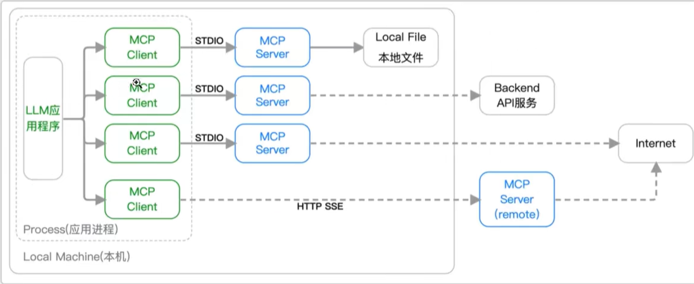
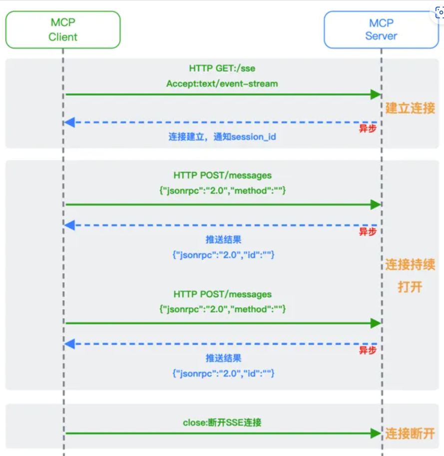
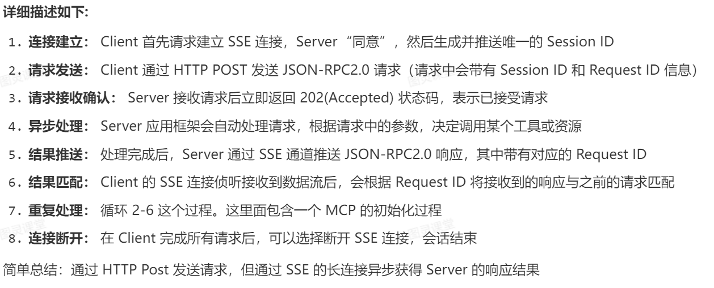
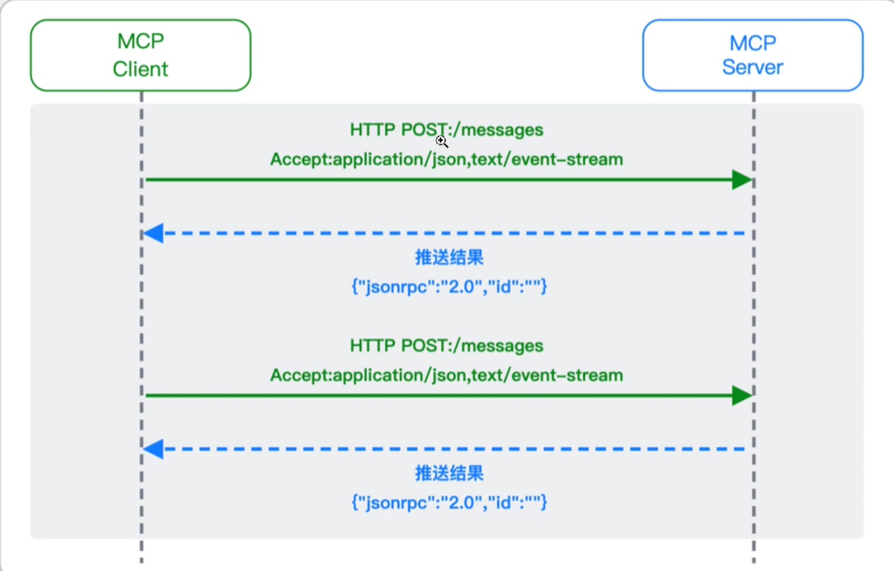

# mcp学习笔记
## mcp的安装
- 安装uv后 - uv init mcp-server-demo
- cd mcp-server-demo
- uv add "mcp[cli]"
- uv run mcp
- 创建mcp server服务器应用
- uv run mcp dev server.py

## FastMCP服务器是与MCP协议交互的核心接口 它处理连接管理、协议合规性和消息路由：
    from mcp.server.fastmcp import FastMCP
    mcp = FastMCP("我的应用")
## 工具 (Tools) - 核心功能
-工具 (Tools) - 执行操作
​功能​：让LLM能够主动调用和执行功能

​特点​：可以产生副作用，执行计算或修改数据

​类比​：POST请求 - 执行操作并返回结果

     @mcp.tool()
    def calculate_sum(a: int, b: int) -> int:
    """计算两个数字的和"""
    return a + b

    #异步工具示例
     @mcp.tool()
    async def process_data(data: str) -> str:
    """处理数据"""
    return f"处理结果: {data.upper()}"

## 资源 (Resources) - 数据暴露
-资源 (Resources) - 提供数据
​功能​：向LLM提供只读数据内容

​特点​：无副作用，类似数据查询接口

​类比​：GET请求 - 获取数据但不修改状态
     
      @mcp.resource("file://documents/{doc_name}")
      def read_document(doc_name: str) -> str:
    """读取文档内容"""
      return f"文档 {doc_name} 的内容"

    @mcp.resource("config://settings")
    def get_settings() -> str:
    """获取应用设置"""
    return '{"theme": "dark", "language": "zh"}'

## 提示模板Prompts
- 提示模板 (Prompts) - 引导交互
​功能​：定义与LLM的交互模式和对话模板

​特点​：结构化对话起点，提高交互效率

​类比​：对话模板 - 预定义的交互模式

     @mcp.prompt()
    def code_review(code: str) -> str:
    """代码审查模板"""
    return f"请审查以下代码：\n\n{code}"

## 上下文管理（Context） .ctx
    from mcp.server.fastmcp import Context

    @mcp.tool()
    async def process_with_context(ctx: Context, data: str) -> str:
    """使用上下文功能的工具示例"""
    
    # 日志记录
    await ctx.info("开始处理数据")
    await ctx.debug(f"原始数据: {data}")
    
    # 进度报告
    await ctx.report_progress(progress=0.3, message="数据处理中")
    
    # 读取其他资源
    config = await ctx.read_resource("config://settings")
    
    # 报告完成进度
    await ctx.report_progress(progress=1.0, message="处理完成")
    await ctx.info("数据处理完成")
    
    return f"处理结果: {data.upper()}"

## 生命周期管理
     from contextlib import asynccontextmanager
    from mcp.server.fastmcp import FastMCP

    class Database:
    """模拟数据库连接"""
    async def connect(self): return self
    async def disconnect(self): pass
    def query(self, sql): return "查询结果"

    @asynccontextmanager
    async def app_lifespan(server: FastMCP):
    """应用生命周期管理"""
    # 启动时初始化
    db = await Database.connect()
    print("数据库连接已建立")
    
    try:
        yield {"database": db}  # 传递给工具使用
    finally:
        # 关闭时清理
        await db.disconnect()
        print("数据库连接已关闭")

    # 创建带生命周期的服务器
    mcp = FastMCP("我的应用", lifespan=app_lifespan)

## 结构化数据输出
- 使用Pydantic模型确保数据格式规范：

       from pydantic import BaseModel, Field
      from typing import List

       class UserProfile(BaseModel):
       """用户信息结构"""
       name: str = Field(description="用户姓名")
      age: int = Field(description="用户年龄")
      email: str = Field(description="邮箱地址")
      tags: List[str] = Field(description="用户标签")

      class WeatherInfo(BaseModel):
       """天气信息结构"""
       temperature: float = Field(description="温度(摄氏度)")
       humidity: float = Field(description="湿度百分比")
       condition: str = Field(description="天气状况")

      @mcp.tool()
      def get_user_profile(user_id: str) -> UserProfile:
       """获取结构化用户信息"""
         return UserProfile(
        name="张三",
        age=30,
        email="zhang@example.com",
        tags=["VIP", "活跃用户"]
       )

       @mcp.tool() 
      def get_weather(city: str) -> WeatherInfo:
       """获取结构化天气信息"""
       return WeatherInfo(
        temperature=22.5,
        humidity=65.0,
        condition="晴天"
    )

## mcp将llm与外部资源集成架构

## MCP传输模式
- 1.消息协议：JSON-RPC2.0. 是一种用于远程过程调用（RPC）的消息交换协议  使用JSON作为数据格式。它是一个应用层的消息格式标准
- 2.MCP的三种传输协议：Stdio（本地）、MCP、Streamable HTTP
- MCP的传输实现
- 客户端/服务层（Client/Server）:两者都是用MCP Session进行同步/异步操作
- 会话层（McpSession）：使用DefaultMcpSession实现管理通信模式和状态
- 传输层（MCP Tran）通过以下三种传输协议种传输协议处理JSON-RPC消息序列化（反序列化）：
- Stdio（本地）：基于标准输入stdin和输出stdout的本地通信方式，MCP Client启动一个**子进程**（MCP Server）并通过标准输入和输出交换JSON-RPC实现通信
- SSE（Web端）：基于HTTP协议的单项通信技术，通过启动端口允许Server向Client端实时推送消息。通过一次get请求建立连接
配合HTTP Post实现Client与Server进行通信，HTTP Post（Client->Server）+HTTP SSE(Server->Client)实现的伪双工通信

- Streamable HTTP：新标准为了解决上文HTTP+SSE方式的问题（维护两个独立端点、连接可靠性高，一旦SSE连接断开，Client无法自动回复，会导致丢失上下文）

Server只需一个统一的HTTP端点用于通信。CLient可以完全无状态的方式与Server进行交互。
**增强的Session管理**，Server在初始化时返回Mcp-Session-id，后续Client在每次请求中需要携带该id。作用是关联一次会话的多次交互，管理交互状态

## SSE
是H5标准中定义的一种基于HTTP的服务器向客户端单向推送实时数据的协议，和新特性包括：
- 单向通信：服务器主动向客户端推送数据，客户端无需轮询
- 自动重连：连接中断后客户端自动尝试恢复。
- 文本流式传输：数据格式为"text/event-stream"，支持纯文本。
- 事件类型支持：可自定义事件名称。

### 技术实现
后端通过"text/event-stream"响应持续发送数据片段，前端监听message事件拼接内容：
- 后端（flask）:
`@app.route('/stream')
def stream():
    def event_stream():
        for i in range(5):
            yield f"data: 消息 {i}\n\n"
            time.sleep(1)
    return Response(event_stream(), mimetype='text/event-stream')`
- 前端(js):
`const eventSource = new EventSource('/stream');
eventSource.onmessage = (event) => {
  console.log('收到:', event.data);
};
eventSource.onerror = () => {
  console.error('连接异常');
};
`

## FastMCP 
# 核心功能
- https://bcn95a8dacj3.feishu.cn/docx/MiGhdIXtpo9pCixEW9zc0AD0nYe